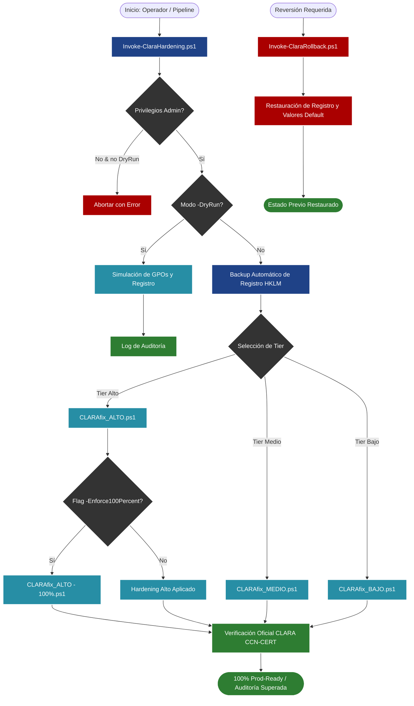

# CCN-CERT CLARA Hardening & Remediation Suite (ENS / NIS2 / CRA)

[](https://www.ccn-cert.cni.es)
[](https://digital-strategy.ec.europa.eu/en/policies/nis2-directive)
[](https://digital-strategy.ec.europa.eu/en/policies/cyber-resilience-act)
[](https://www.ccn-cert.cni.es/guias.html)

## 📌 Resumen Ejecutivo
La **Suite de Bastionado y Remediación Automática CCN-CERT** es un motor de ingeniería defensiva diseñado para alinear infraestructuras basadas en Windows con los requisitos más exigentes del **Esquema Nacional de Seguridad (RD 311/2022)** de España, la **Directiva Europea NIS2** y la **Cyber Resilience Act (CRA)**.

Resuelve de forma determinista y auditable las desviaciones detectadas por la herramienta oficial **CLARA** del Centro Criptológico Nacional (CCN-CERT), garantizando un **Score del 100%** sin romper la operatividad del sistema.

---

## 🏗️ Flujo de Operación y Arquitectura (Mermaid)



---

## 📊 Matriz Comparativa de Tiers ENS

| Característica / Control | Nivel BAJO | Nivel MEDIO | Nivel ALTO (100% Precisión) |
| :--- | :---: | :---: | :---: |
| **Bloqueo de Puesto (OP.ACC.4)** | Básico | Automático (15 min) | Forzado con pantalla bloqueada y UAC elevado |
| **Protección NTLM (MP.COM.3)** | Estándar | NTLMv2 forzado (`LmCompat=5`) | NTLMv2 128-bit + Auditoría Denegación Tráfico |
| **DCOM SDDL Restrictions (OP.ACC.5)** | N/A | Filtrado Básico | DACL binaria compilada para Administrators/AuthUsers |
| **Hardening de SMB (MP.COM.2)** | SMBv1 deshabilitado | SMBv1 off + Firma digital | SMBv1 off + Firma forzada + Cifrado obligatorio |
| **Auditoría de Procesos (OP.MON.1)** | Eventos de Inicio | Logons + Account Lockout | Command Line Auditing + Detalle Completo |
| **Modo de Rollback Seguro** | :white_check_mark: | :white_check_mark: | :white_check_mark: (Snapshot `.reg` previo) |
| **Simulación (`-DryRun`)** | :white_check_mark: | :white_check_mark: | :white_check_mark: |

---

## 🚀 Guía de Uso del CLI de Bastionado

### 1. Simulación sin riesgo (Dry-Run)
Evalúa las políticas y configuraciones que se aplicarían sin modificar ninguna clave de registro:
```powershell
.\Invoke-ClaraHardening.ps1 -Tier Alto -DryRun
```

### 2. Aplicación Completa con Precisión 100% (ENS Alto)
Crea una copia de seguridad previa de las ramas del registro y aplica el bastionado completo:
```powershell
.\Invoke-ClaraHardening.ps1 -Tier Alto -Enforce100Percent -BackupState
```

### 3. Aplicación para Entornos ENS Medio / Bajo
```powershell
# Nivel Medio
.\Invoke-ClaraHardening.ps1 -Tier Medio

# Nivel Bajo
.\Invoke-ClaraHardening.ps1 -Tier Bajo
```

### 4. Reversión de Cambios (Rollback Inmediato)
Si necesita restaurar el sistema a los valores por defecto o restaurar un backup específico:
```powershell
# Reversión por perfil
.\Invoke-ClaraRollback.ps1 -Tier Alto

# Restauración desde backup .reg exacto
.\Invoke-ClaraRollback.ps1 -RestoreBackupFile ".\backups\RegBackup_PreClara_Alto_20260818_210633.reg"
```

---

## 📚 Estructura de Directorios

```text
CLARA FIX TOOLS/
├── Invoke-ClaraHardening.ps1         # Orquestador maestro de bastionado
├── Invoke-ClaraRollback.ps1          # Orquestador maestro de reversión
├── README.md                         # Documentación técnica ejecutiva
├── CATALOGO_MITIGACION_ENS_NIS2.md  # Matriz de herramientas (Semgrep, Bandit, Falco...)
├── backups/                          # Puntos de restauración automáticos (.reg)
├── ALTO/                             # Perfil ENS Alto (RD 311/2022)
│   ├── CLARAfix_ALTO.ps1             # Hardening base ENS Alto
│   ├── CLARAfix_ALTO - 100%.ps1      # Parche de precisión 100%
│   ├── CLARA_Rollback_ALTO.ps1       # Script de reversión
│   ├── CLARAfix_ALTO_MANUAL.md       # Guía de controles no automatizables
│   └── GUIA_SECEDIT_GPOS.md          # Especificación de SDDL y GPOs
├── MEDIO/                            # Perfil ENS Medio
│   ├── CLARAfix_MEDIO.ps1            # Hardening base ENS Medio
│   ├── CLARA_Rollback_MEDIO.ps1      # Script de reversión
│   └── MANUAL_HARDENING_MEDIO.md     # Guía de verificación manual
└── BAJO/                             # Perfil ENS Bajo
    ├── CLARAfix_BAJO.ps1             # Hardening base ENS Bajo
    ├── CLARA_Rollback_BAJO.ps1       # Script de reversión
    └── MANUAL_HARDENING_BAJO.md      # Guía de verificación manual
```

---

## ⚖️ Alineación Regulatoria Oficial

1. **Esquema Nacional de Seguridad (ENS - RD 311/2022):**
   - Cumple con las familias de medidas de seguridad: Marco Operacional (`op.acc`, `op.exp`, `op.mon`) y Medidas de Protección (`mp.com`, `mp.si`, `mp.eq`).
2. **Directiva NIS2 (UE 2022/2555) Art. 21:**
   - Satisface los requisitos de higiene cibernética básica, control de acceso, seguridad en la cadena de suministro y gestión de vulnerabilidades.
3. **Cyber Resilience Act (CRA):**
   - Reduce la superficie de ataque del host anfitrión donde residen componentes de software y contenedores regulados.
